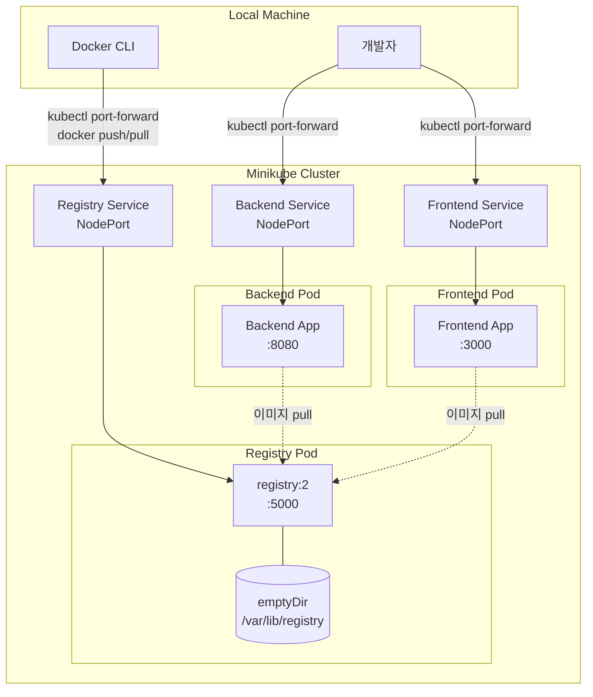

# 설계 문서: Minikube K8s 로컬 개발 환경 구성

## 개요

이 설계 문서는 Minikube 기반 로컬 Kubernetes 클러스터에서 백엔드, 프론트엔드, Docker Private Registry를 배포하기 위한 매니페스트 구조와 아키텍처를 정의한다.

모든 Kubernetes 리소스는 `k8s/` 디렉토리에 개별 YAML 파일로 관리되며, `kubectl apply -f k8s/` 명령으로 일괄 배포가 가능하다. 각 애플리케이션은 Deployment + Service(NodePort) 쌍으로 구성되고, `kubectl port-forward`를 통해 로컬에서 접근한다.

### 설계 결정 사항

1. **개별 YAML 파일 분리**: 리소스별 파일 분리로 변경 이력 추적과 선택적 배포가 용이하다.
2. **NodePort Service 타입**: Minikube 환경에서 LoadBalancer 대비 설정이 간단하고, port-forward와 조합하여 로컬 접근이 가능하다.
3. **emptyDir 볼륨 (Registry)**: 로컬 개발 환경이므로 PVC 대신 emptyDir을 사용하여 설정 복잡도를 낮춘다. Pod 재시작 시 데이터가 유실되지만 개발 환경에서는 허용 가능하다.
4. **registry:2 공식 이미지**: Docker Hub의 공식 Registry 이미지를 사용하여 별도 빌드 없이 Private Registry를 구성한다.

## 아키텍처



### 배포 흐름

1. Minikube 클러스터 시작
2. `kubectl apply -f k8s/` 로 전체 리소스 배포
3. Registry가 먼저 기동된 후, 로컬에서 이미지를 빌드하여 Registry에 push
4. Backend/Frontend Deployment가 Registry에서 이미지를 pull하여 Pod 기동
5. `kubectl port-forward`로 로컬에서 각 서비스에 접근

## 컴포넌트 및 인터페이스

### 파일 구조

```
k8s/
├── backend-deployment.yaml    # 백엔드 Deployment
├── backend-service.yaml       # 백엔드 Service (NodePort)
├── frontend-deployment.yaml   # 프론트엔드 Deployment
├── frontend-service.yaml      # 프론트엔드 Service (NodePort)
├── registry-deployment.yaml   # Docker Registry Deployment
└── registry-service.yaml      # Docker Registry Service (NodePort)
README.md                      # 클러스터 구성 및 배포 가이드
```

### 컴포넌트 상세

#### 1. Registry (Docker Private Registry)

| 항목 | 값 |
|------|-----|
| 이미지 | `registry:2` |
| 컨테이너 포트 | 5000 |
| 볼륨 마운트 | `/var/lib/registry` (emptyDir) |
| replicas | 1 |
| 라벨 | `app: registry` |

#### 2. Backend

| 항목 | 값 |
|------|-----|
| 이미지 | `localhost:5000/backend:latest` (Registry 경유) |
| 컨테이너 포트 | 8080 |
| replicas | 1 |
| 라벨 | `app: backend` |

#### 3. Frontend

| 항목 | 값 |
|------|-----|
| 이미지 | `localhost:5000/frontend:latest` (Registry 경유) |
| 컨테이너 포트 | 3000 |
| replicas | 1 |
| 라벨 | `app: frontend` |

### 인터페이스 (Service)

| Service | 타입 | 셀렉터 | targetPort | 용도 |
|---------|------|--------|------------|------|
| backend-service | NodePort | `app: backend` | 8080 | 백엔드 Pod 접근 |
| frontend-service | NodePort | `app: frontend` | 3000 | 프론트엔드 Pod 접근 |
| registry-service | NodePort | `app: registry` | 5000 | Registry push/pull |

### port-forward 매핑

```bash
kubectl port-forward svc/registry-service 5000:5000   # Registry
kubectl port-forward svc/backend-service 8080:8080     # Backend
kubectl port-forward svc/frontend-service 3000:3000    # Frontend
```

## 데이터 모델

이 프로젝트의 데이터 모델은 Kubernetes 매니페스트 YAML 구조이다.

### Deployment 매니페스트 구조

```yaml
apiVersion: apps/v1
kind: Deployment
metadata:
  name: <deployment-name>
  labels:
    app: <app-label>
spec:
  replicas: 1
  selector:
    matchLabels:
      app: <app-label>
  template:
    metadata:
      labels:
        app: <app-label>
    spec:
      containers:
        - name: <container-name>
          image: <image-path>
          ports:
            - containerPort: <port>
          resources:
            requests:
              memory: "<memory-request>"
              cpu: "<cpu-request>"
            limits:
              memory: "<memory-limit>"
              cpu: "<cpu-limit>"
```

### Service 매니페스트 구조

```yaml
apiVersion: v1
kind: Service
metadata:
  name: <service-name>
  labels:
    app: <app-label>
spec:
  type: NodePort
  selector:
    app: <app-label>
  ports:
    - port: <service-port>
      targetPort: <container-port>
      protocol: TCP
```

### 리소스 제한 기본값

| 컴포넌트 | CPU 요청 | CPU 제한 | 메모리 요청 | 메모리 제한 |
|----------|---------|---------|-----------|-----------|
| Backend | 100m | 500m | 128Mi | 256Mi |
| Frontend | 100m | 500m | 128Mi | 256Mi |
| Registry | 100m | 500m | 128Mi | 512Mi |

